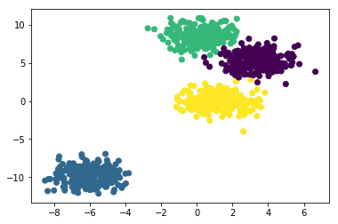

# NetAPI

This is a Neural Network (multilayer perceptron) with my custom-built API ``myneuralnetapi.py``. Tested on a classic MNIST dataset. Dataset is taken from here: [Kaggle MNIST competition](https://www.kaggle.com/c/digit-recognizer/data)

***Note: I built whole API using only Numpy library. For practice.***

Implemented:

* forward/backward propagation
* batch gradient descent
* Adam optimization
* L2-regularization
* gradient checking

## Structure

* ``myneuralnetapi.py`` - neural network API module
* ``network_main.py``   - the main network which is trained on MNIST dataset
* ``network_test.py``   - testing the network using dummy data, vizualizing the boundaries
* ``datahandler.py``    - a class to handle MNIST data and feed minibatches into the neural network
* ``run_params.json``   - run mode parameters for ``network_main.py``

## Performance on MNIST dataset

The network was trained for a short time on a MNIST dataset to demonstrate its performance. The full implementation is in ```network_main.py```.

> **Results**
> - Train accuracy: 100.00%
> - Dev accuracy:    97.95%
> - Test accuracy:   97.33%
>
> *Looking at results, it's obvious that the model has some variance. Reducing this variance is outside the scope of this exercise and is addressed using CNNs with Tensorflow in another repo.*

> **Layers in the network**
> - layer 0: input, units: 784 (grayscale images 28 x 28)
> - layer 1: relu, units: 400
> - layer 2: relu, units: 200
> - layer 3: relu, units: 100
> - layer 4: relu, units: 50
> - layer 5: relu, units: 25
> - layer 6: softmax, units: 10


## Testing the network

Network testing is implemented in ```network_test.py``` with dummy data with 2 features for easy visualization. Plots below illustrate that the network does what it's supposed to do. Accuracy is **99.9%** due to overlapping classes.

> **Layers in the network**
> - layer 0: input, units: 2
> - layer 1: relu, units: 10
> - layer 2: relu, units: 10
> - layer 3: relu, units: 10
> - layer 4: relu, units: 10
> - layer 5: softmax, units: 4




