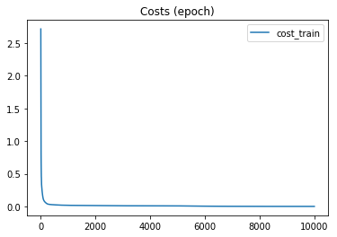

_Disclaimer: this project was completed long time ago **during my time in academia**._

# NetLib

This is my neural network library implementation built using **Numpy only**. I did it in the very beginning of my Deep Learning course, even before studying frameworks like TensorFlow or Keras.

Tested on a classic MNIST dataset. The dataset is taken from here: [Kaggle MNIST competition](https://www.kaggle.com/c/digit-recognizer/data).

Implemented:

* forward/backward propagation
* batch gradient descent
* Adam optimization
* L2-regularization
* gradient checking

## Folder structure

* ``myneuralnetapi.py`` - neural network library module
* ``network_main.py``   - the main network which is trained on MNIST dataset
* ``network_test.py``   - testing the network using dummy data, vizualizing the boundaries
* ``datahandler.py``    - a class to handle MNIST data and feed minibatches into the neural network
* ``run_params.json``   - run mode parameters for ``network_main.py``

## Performance on MNIST dataset

The network was trained on AWS instance for a short time using the MNIST dataset to demonstrate that it works. The full implementation is in ```network_main.py```.

> **Accuracy**
> - Train: 100.00%
> - Dev:    97.70%
> - Test:   97.43%
>
> *Looking at results, it's obvious that the model overfit the dataset and has **variance**. Reducing this variance is outside the scope of this exercise and is addressed using CNNs with Tensorflow in another repo.*

> **Layers in the network**
> - layer 0: input, units: 784 (grayscale images 28x28x1)
> - layer 1: relu, units: 700
> - layer 2: relu, units: 400
> - layer 3: relu, units: 200
> - layer 4: relu, units: 100
> - layer 5: relu, units: 50
> - layer 6: relu, units: 25
> - layer 7: softmax, units: 10

<div>


</div>

## Testing the network

Network testing is implemented in ```network_test.py``` with dummy data with 2 features for easy visualization. Plots below illustrate that the network does what it's supposed to do. Accuracy is **99.9%** due to overlapping classes.

> **Layers in the network**
> - layer 0: input, units: 2
> - layer 1: relu, units: 10
> - layer 2: relu, units: 10
> - layer 3: relu, units: 10
> - layer 4: relu, units: 10
> - layer 5: softmax, units: 4



